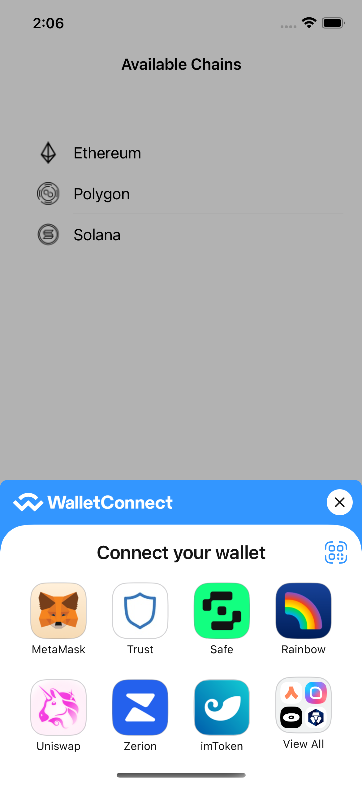
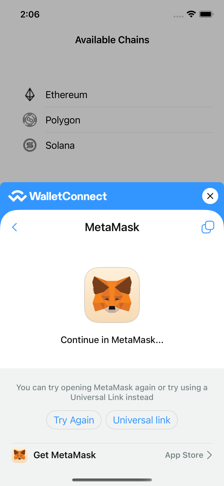
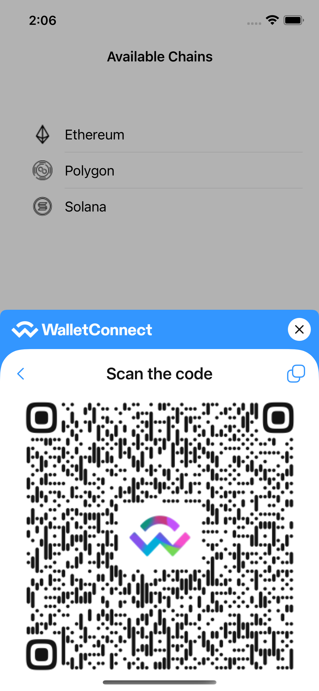

#### 📚 [Documentation](https://docs.walletconnect.com/2.0/advanced/walletconnectmodal/about?platform=ios)

# WalletConnect Modal

Simplest and most minimal way to connect your users with WalletConnect.

  
  
  

